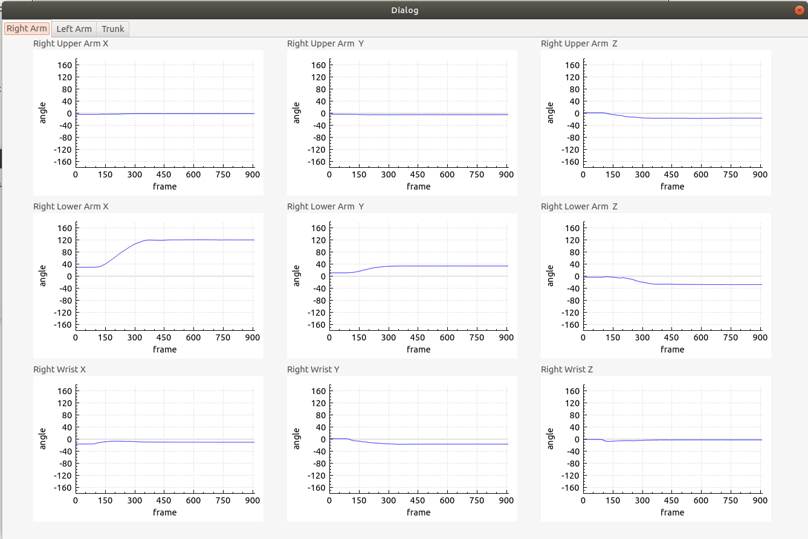
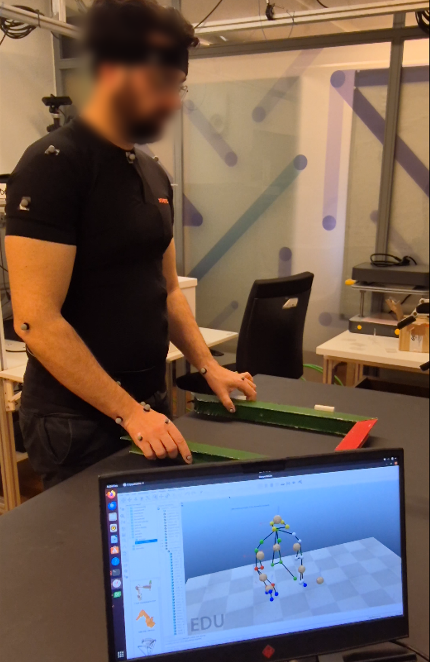

# Real-Time Human Postural Assessment (Qualisys System)

This project provides software for human posture assessment based on RULA method, using Qualisys data (both previously recorded data and real-time mode).
The algorithm was developed in C++ using the Qt Creator IDE.

## Pre Requisites 
- Operating System: Linux (Ubuntu 18/20)
- ROS
- CoppelliaSim
- QtCreator
- qualisys_cpp_sdk (for real-time data analysis), available at https://github.com/qualisys/qualisys_cpp_sdk

## Installation

- Create a ROS workspace in the home directory and place the downloaded src folder inside it.
- Open a terminal and execute: $catkin_make.
- Create a ROS project in QtCreator and set the newly created ROS workspace as the project workspace.

## Graphical User Interface Overview

The GUI allows the user to select the analysis mode: previously recorded data or real-time data.

- Analysis of previously recorded data:
The user can select a .tsv file generated by Qualisys after a recording, which contains the motion capture data.

- Real-time analysis:
The user can connect directly to the Qualisys server to stream motion capture data in real time.

Once the Run button is pressed, the movement is visualized in a simulation scenario created in CoppeliaSim, with reference to postural assessment using a color-coded system.
When the execution is stopped, a report file is automatically generated summarizing the analysis.

---

## System Overview

* Motion capture is performed using the **Qualisys system**. 
* The developed software processes the received data to extract the **3D coordinates of each Qualisys marker**. 
* Using the marker coordinates, the software computes the **body segment planes**. 
  The markers required to define each body segment are listed in the following table: 

### Body Segments and Markers
| Body Segment       | Marker Names |
| ------------------ | -------------------------------- |
| Right Arm          | RLE_elb, RME_elb, RAC_sho |
| Right Forearm      | RUS_wrist, RRS_wrist, RLE_elb | 
| Right Wrist        | RHM2_hand, RHL5_hand, RUS_wrist, RRS_wrist |
| Left Arm           | LLE_elb, LME_elb, LAC_sho |
| Left Forearm       | LUS_wrist, LRS_wrist, LLE_elb |
| Left Wrist         | LHM2_hand, LHL5_hand, LUS_wrist, LRS_wrist |
| Trunk              | RPSI_back, LPSI_back, C7 |

* For each body segment, the software defines a **Cartesian reference frame**, following the **Right-Hand Rule**, as illustrated in the avatar model within **CoppeliaSim**. 

* The software then computes the **joint angles** by comparing **two consecutive Cartesian reference frames**. 
  The corresponding definitions are summarized in the following table: 

### Joints and Reference Frames
| Joint              | Cartesian Reference Frames |
| ------------------ | --------------------------- |
| Right Shoulder     | Trunk , Right Arm |
| Right Elbow        | Right Arm , Right Forearm | 
| Right Wrist        | Right Forearm , Right Wrist |
| Left Shoulder      | Trunk , Left Arm |
| Left Elbow         | Left Arm , Left Forearm |
| Left Wrist         | Left Forearm , Left Wrist |
| Trunk              | World Scenario , Trunk |

* The **time evolution of the joint angles** is displayed in plots and exported as **TXT reports**. 

  

### RULA Factors Mapping

| Body Segment | Joint Name                | Euler Component (ZXY) | RULA Factor                                  |
| ------------ | ------------------------- | --------------------- | ---------------------------------------------|
| Arm          | jR_arm / jL_arm 		   | X / Y                 | Flexion / Abduction                          |
| Forearm      | jR_forearm / JLeftElbow   | X / Z                 | Flexion / Midline exceeded                   |
| Wrist        | jR_wrist / JLeftWrist     | Y / X / Z             | Flexion / Wrist midline exceeded / Pronation |
| Neck         | j_neck                    | X / Y / Z             | Flexion / Lateral inclination / Rotation     |
| Trunk        | j_trunk                   | X / Y / Z             | Flexion / Lateral inclination | Rotation     |

This mapping allows the software to automatically extract the ergonomic evaluation factors directly from the captured motion data.

* Movements can also be **replicated in CoppeliaSim** through a human avatar. 
* Communication with CoppeliaSim is handled via **ROS**.
* Communication with Qualisys Streaming is handled via Qualisys_cpp_sdk. 

  

---

